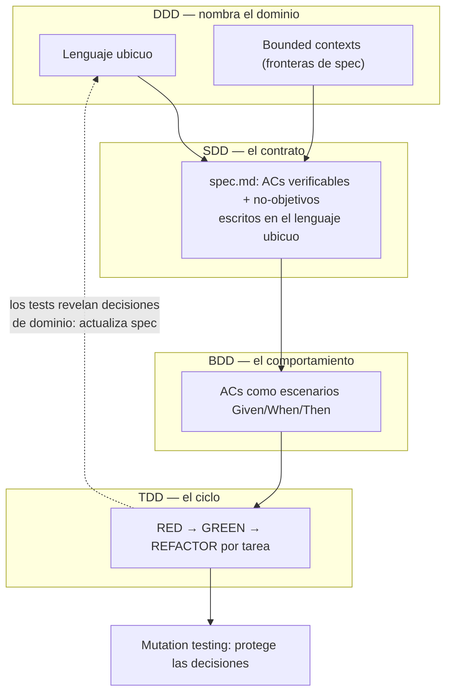

<!--
  cheatsheets/las-cuatro-d.md
  ----------------------------------
  La conciliación de las cuatro D: DDD, SDD, BDD y TDD. Cuatro altitudes
  de la misma intención, cada una con su pregunta y su artefacto. Fondo:
  M2 (pipeline), M6 §6.6 (test gaming), M3 §3.6 (ADRs). Fecha de medición
  del discurso: 2026-09-22.
-->

# ¿Cómo concilian DDD, SDD, BDD y TDD?

> **Las cuatro D son cuatro altitudes de la misma intención.** Ninguna
> reemplaza a la otra: cada una protege una capa distinta y la cadena
> completa es lo que produce código confiable con agentes.

## La cadena de altitudes

| Altura | Metodología | La pregunta | El artefacto | Fondo |
|---|---|---|---|---|
| **Dominio** | **DDD** | ¿De qué hablamos y dónde están las fronteras? | Lenguaje ubicuo + bounded contexts + agregados | M2 §2.2 (lenguaje en los ACs) |
| **Contrato** | **SDD** | ¿Qué construimos y qué lo define como hecho? | `spec.md` con ACs verificables y no-objetivos | M2 §2.2 |
| **Comportamiento** | **BDD** | ¿Qué debe poder hacer el sistema, en palabras del negocio? | Escenarios ejecutables Given/When/Then | M2 §2.5 (conecta ACs ↔ tests) |
| **Implementación** | **TDD** | ¿Cómo implemento cada pieza con un test que la respalde? | Ciclo RED → GREEN → REFACTOR por tarea | M2 §2.8; M6 §6.6.4 |

**El flujo completo, de arriba hacia abajo:** DDD te da el **lenguaje
ubicuo** y las **fronteras** (cada bounded context es una frontera de spec
— y la frontera de paralelización del M2 §2.3). SDD captura el **contrato**
por contexto, escrito en ese lenguaje. BDD convierte los ACs en
**escenarios ejecutables** que un stakeholder entiende (Given/When/Then).
TDD implementa cada tarea con el ciclo disciplinado. Y el feedback sube:
los tests revelan decisiones de dominio → actualizas spec y lenguaje
(Spec-Anchored, M2 §2.2).

## El insight del 2026: "BDD macro, TDD micro"

La síntesis del discurso actual (Krishnan, *Spec-Driven Development:
Engineering with Intent*, Manning 2026): **SDD ancla el trabajo en la
especificación, BDD protege el comportamiento macro y TDD mejora el diseño
micro**.

- Un workflow **SDD + BDD** puede satisfacer todos los escenarios de
  aceptación y aun así dejar el interior como espagueti acoplado: los
  escenarios macro no fuerzan fronteras internas claras.
- **TDD aporta el micro**: tests angostos que fuerzan contratos pequeños,
  errores exactos y límites de colaboración — y el refactoring que los
  mantiene desacoplados.
- DDD está arriba de todo: sin lenguaje ubicuo, los escenarios BDD hablan
  el idioma del *implementador*, no del dominio — y las fronteras de los
  bounded contexts se difuminan.

## Cómo los agentes hackean el TDD (4 modos + contadores)

Pedirle "usá strict TDD" al agente no garantiza nada. Los 4 hackeos
observados y su contador mecánico:

| # | Hackeo | Cómo se ve | Contador |
|---|---|---|---|
| 1 | **Horizontal slicing** | Un test solo que cruza varios comportamientos → un gran paso de implementación los vuelve verdes juntos | Una **vertical slice por commit**: el historial de git es la prueba del ciclo |
| 2 | **Implementación más allá de lo ejemplificado** | Tests chicos pero el código introduce ramas que ningún ejemplo prueba | **Branch coverage** (no solo line coverage) |
| 3 | **Aserciones débiles** | Ciclo red-green correcto pero checks vagos ("espero error", "aprox") | **Mutation testing**: un mutante sobreviviente = una decisión sin proteger (M6 §6.3.4) |
| 4 | **Duplicación en el código de test** | Setup y estructura repetidos en cada test → suite frágil | Detección de duplicación (p.ej. `jscpd`) + refactor de tests |

Fondo: M6 §6.6 — la defensa es estructural, no retórica.

## Cuándo aporta cada una

| Situación | Qué activas |
|---|---|
| El dominio es complejo o desconocido para el equipo | DDD primero: lenguaje ubicuo y bounded contexts → tus specs parten bien |
| Los ACs son ambiguos para un stakeholder | BDD: escenarios Given/When/Then en el lenguaje del negocio — son tus ACs en formato ejecutable |
| El agente implementa pero el diseño se degrada | TDD estricto con mocks: contratos angostos por tarea |
| Sospechas test gaming | Los 4 hackeos de arriba + el pipeline del M6 §6.8 |

## La metodología integrada: un solo flujo que las contiene

La construcción lógica y pedagógica — cómo las cuatro se complementan en
**una metodología única** (la de este curso, ahora con BDD y DDD dentro):

El resultado es **una metodología que contiene a las cuatro**:

1. **DDD nombra** — el lenguaje ubicuo define qué palabras significan en tu
   dominio y los bounded contexts definen dónde termina cada spec (y dónde
   empieza la otra). Es el idioma del contrato.
2. **SDD contrata** — cada spec captura el comportamiento en ACs binarios,
   escritos con ese lenguaje, con no-objetivos y `[NEEDS CLARIFICATION]`
   bloqueantes.
3. **BDD comunica** — cada AC se expresa como escenario Given/When/Then:
   el negocio lo entiende, el agente lo puede verificar, y el test que
   automatiza el escenario es tu RED.
4. **TDD protege** — el ciclo por tarea implementa y el refactoring protege
   las unidades; mutation testing audita que los tests protejan las
   decisiones, no solo las líneas.
5. **El feedback cierra el círculo** (línea punteada): los tests y las
   mutantes revelan decisiones de dominio que faltaban — actualizas el
   lenguaje y la spec, y la pila vuelve a correr. Es Spec-Anchored con
   DDD debajo.

**La práctica colaborativa** que BDD añade al taller del M2: los
"three amigos" (negocio + dev + QA) escriben los escenarios juntos — el
mismo espíritu de tus sesiones de grilling, aplicado a la spec.

## Referencias canónicas de las cuatro D

- **DDD:** Eric Evans, *Domain-Driven Design* (2003) — el origen del
  lenguaje ubicuo y los bounded contexts. Guía práctica:
  [Microsoft — DDD](https://learn.microsoft.com/en-us/dotnet/architecture/microservices/microservice-ddd-microservice/microservice-ddd-microservice)
  y Vaughn Vernon, *Implementing Domain-Driven Design*.
- **BDD:** Dan North, [Introducing BDD](https://dannorth.net/blog/introducing-bdd/) (2006) — el origen explícito: TDD + el lenguaje ubicuo de Evans. [Cucumber — docs](https://cucumber.io/docs/bdd/) (Gherkin, three amigos, Given/When/Then).
- **TDD:** Kent Beck, *Test-Driven Development: By Example* (2002); el ciclo
  aplicado a agentes está en M2 §2.8 (Nivel 1.5) y M6 §6.6.5.
- **SDD:** el paper AIWare 2026, Spec Kit, Böckeler y Krishnan — todas las
  refs de M2 §2.9 y M9 §9.9.

> **Veredicto:** no elijas entre las cuatro D — ordénalas por altura. El
> dominio nombra, la spec contrata, el escenario comunica, el test
> protege. Discurso verificado el 2026-09-22 (Krishnan, *How TDD and BDD
> Actually Fit Into SDD*, intent-driven.dev); el ecosistema cambia, la
> estratificación no.

---