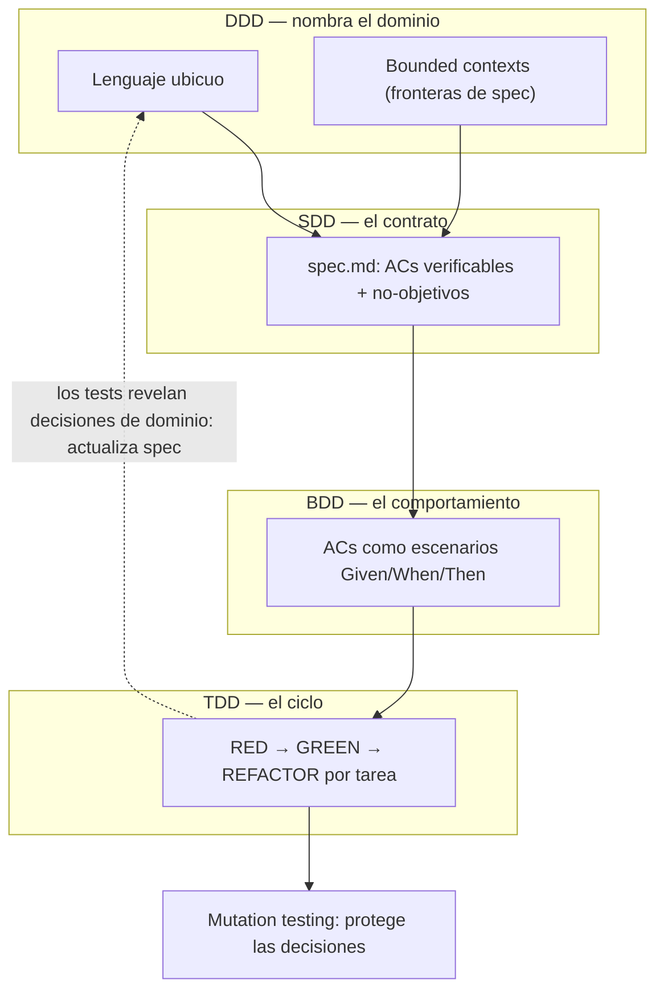

# Módulo 2 — Especificar, Planificar y Ejecutar con Agentes

> **Núcleo metodológico del curso.**
> Si solo lees un módulo, que sea este.
> Todo lo demás (harness, handoffs, verificación) existe para *servir* a lo que aquí se construye: un contrato entre un humano y un agente.

---

## Evidencia de logro

> Al terminar este módulo debes poder:

| # | Objetivo | Cómo se comprueba |
|---|----------|-------------------|
| 1. | **Escribe** una spec con ACs binarios, no-objetivos y ambigüedades marcadas `[NEEDS CLARIFICATION]`. | Quiz M2; lab-02; plantilla `templates/spec.md`. |
| 2. | **Elige** el nivel de rigor (Spec-First / Spec-Anchored / Spec-as-Source) justificando por contexto. | Quiz M2; §2.2. |
| 3. | **Descompone** una spec en phases y tasks atómicas ejecutables por subagentes de contexto fresco. | Quiz M2; §2.3/2.5. |
| 4. | **Distingue** los artefactos del pipeline (spec/roadmap/state.json/tasks/plan/feature_list) y qué "verdad" porta cada uno. | Quiz M2; §2.6; ejemplo `examples/m2-unified-workflow/`. |

**Práctica recomendada:** lab-02 — feature completo desde la spec (ver [`lab-02-spec-driven-feature`](../labs/lab-02-spec-driven-feature/)).

---

## 2.1 Por qué una metodología (y no solo "vibe coding")

### El problema de la intención no especificada

Cuando le pides a un agente *"añade filtros a la lista de proyectos"*, estás delegando miles de micro-decisiones que no le diste:

- ¿La fecha es de creación o de actualización?
- ¿El rango es inclusivo en los dos extremos?
- ¿El filtro va en el endpoint actual o en uno nuevo?
- ¿Qué pasa si no llega ningún filtro?
- ¿Los estados son un enum fijo o vienen de base de datos?

El agente **va a responder todas esas preguntas**. Lo que no le diste, lo inventa — y lo hace dentro de su contexto, donde nadie lo revisa. Esa es la raíz de los tres problemas más caros del trabajo con agentes:

1. **Scope creep:** el agente decide que "añadir filtros" incluye también ordenamiento y vistas guardadas, porque suena relacionado.
2. **Hallucination consentida:** inventa un campo o un endpoint que "tendría sentido" y lo implementa como si existiera.
3. **Tests que pasan pero testean lo equivocado:** escribe tests que confirman su suposición, no la tuya. El resultado es "verde" pero falso.

### De "promptear y rezar" a "contrato verificable"

Hay dos modelos de trabajo con agentes, y la diferencia no es la herramienta:

| Modelo                      | Cómo se delega                         | Dónde se decide lo ambiguo       | Cómo sabes que está hecho         |
|-----------------------------|----------------------------------------|----------------------------------|-----------------------------------|
| **Vibe coding**             | Un prompt en lenguaje natural          | Dentro del contexto del agente   | "Se ve que funciona"             |
| **Spec-Driven Development** | Una spec (contrato) + un plan          | En la spec, antes de codear      | Cada AC tiene un test que pasa   |

En vibe coding, la ambigüedad se resuelve **en runtime, dentro del agente, sin auditoría**. En SDD, se resuelve **en la spec, con revisión humana, antes de que se escriba una línea de código**. El agente no decide más; ejecuta contra un contrato.

> **Frase que conviene memorizar:** *el código es un artefacto de la especificación.* Si la especificación es buena, el agente no tiene margen para equivocarse sobre el qué. Solo sobre el cómo — y eso lo controla el harness y los tests.

### El ecosistema: SDD + GSD + Superpowers

Estos tres frameworks no compiten; ocupan capas distintas del mismo pipeline:

| Framework        | Capa                   | Pregunta que responde                  | Artefacto central             |
|------------------|------------------------|----------------------------------------|-------------------------------|
| **SDD**          | Especificación        | ¿Qué construimos y qué lo define como hecho? | `spec.md`                |
| **GSD**          | Orquestación           | ¿Cómo organizamos el trabajo para que sobreviva entre sesiones? | `.planning/` (state machine) |
| **Superpowers**  | Implementación        | ¿Cómo ejecutamos cada tarea sin que el agente se desvíe? | `plan.md` + TDD + subagents |

Una analogía útil: **SDD es el plano arquitectónico, GSD es la obra con cronograma y cuadrillas, Superpowers es el manual de construcción y control de calidad.** Puedes usar solo SDD y ya ganar mucho. Puedes sumar GSD cuando tus tareas duren más de una sesión. Puedes sumar Superpowers cuando necesites que el código salga con calidad por defecto, no por suerte.

---

## 2.2 Spec-Driven Development (SDD)

### Los tres niveles de rigor

No toda spec tiene que ser igual de formal. El paper *"Spec-Driven Development: From Code to Contract"* (AIWare 2026) define tres niveles, y la regla de oro es **usar el mínimo nivel que elimine la ambigüedad para tu contexto**:

| Nivel             | La spec vive...                          | Cuándo usarlo                                  |
|-------------------|------------------------------------------|------------------------------------------------|
| **Spec-First**     | Antes de codear; puede derivar después   | Prototipos, pruebas de concepto, verde         |
| **Spec-Anchored** | Junto al código; los tests fuerzan alineación | La mayoría del código de producción (sweet spot) |
| **Spec-as-Source**| Es lo único que editan humanos; el código se genera | Dominios con generación confiable (OpenAPI, Simulink) |

El error más común es creer que más rigor es siempre mejor. No lo es: over-specificar un prototipo cuesta más en burocracia de lo que ahorra en bugs. El otro error, más caro, es usar Spec-First donde haría falta Spec-Anchored: la spec deriva, nadie la actualiza, y termina mintiendo sobre el código.

> **Heurística:** si el feature va a producción y va a ser mantenido por alguien que no eres tú, usa Spec-Anchored como mínimo.

### La spec como "super-prompt"

Los LLM son excelentes completando patrones y malos leyendo mentes. Una spec bien escrita **descompone un problema complejo en componentes modulares que caben en la context window del agente** y, sobre todo, quita la necesidad de adivinar.

El paper "Spec-Driven Development: From Code to Contract" (AIWare 2026) reporta que las specs refinadas por humanos pueden reducir los errores del código generado por LLM **hasta un 50%**. Eso no es magia: es simplemente que la spec eliminó 50% de las decisiones que el agente habría tomado en silencio.

Tres propiedades de una buena spec, pensada como super-prompt:
1. **Descompone:** cada RF es independiente y mapea a ACs verificables.
2. **Es binaria:** cada AC se puede marcar ✅ o ❌ sin opinión.
3. **Es bloqueante:** los `[NEEDS CLARIFICATION]` detienen al agente en lugar de invitarlo a adivinar.

### Anatomía de `spec.md` (archivo `templates/spec.md`)

La plantilla tiene 12 secciones. No todas son obligatorias, pero las obligatorias son el mínimo no negociable. Repaso el porqué de cada una:

| Sección                              | Obligatoria | Por qué importa                                            |
|--------------------------------------|-------------|------------------------------------------------------------|
| 1. Contexto y motivación             | Sí          | El agente entiende el problema; no resuelve el problema equivocado. |
| 2. Objetivos y no-objetivos          | Sí          | Los no-objetivos son la **primera defensa contra el scope creep**. |
| 3. Invariantes y constraints        | Sí          | Lo que el agente no puede negociar. Inmutable.            |
| 4. Requisitos funcionales (RF)      | Sí          | El QUÉ, no el cómo. Comportamiento, no implementación.    |
| 5. Criterios de aceptación (AC)     | Sí          | **El corazón.** Si no puedes escribir un test, el AC está mal. |
| 6. Dependencias y prerequisitos     | Opcional    | Mapea el bloqueo y el desbloqueo.                          |
| 7. Diseño técnico (pista, no solución) | Opcional | Pistas de archivos y patrones. La implementación NO va aquí. |
| 8. Datos de prueba / escenarios     | Opcional    | Seed data y edge cases para QA.                           |
| 9. Rollback plan                    | Recomendado | Cómo revertir si sale mal.                                |
| 10. Decisiones abiertas             | Sí si hay   | `[NEEDS CLARIFICATION]` = bloqueante.                     |
| 11. Definición de "Verificado"      | Sí          | Lo que convierte la spec en "hecha".                      |
| 12. Trazabilidad                     | Opcional    | Conecta ticket → roadmap → plan → PR → commit.             |

**Tres anti-patrones de specs que engañan al agente** (y cómo se ven en la práctica):

- **AC opinable:** *"la UI debe ser clara y rápida"*. No hay comando que devuelva pass/fail. → Reescribir: *"el panel carga en p95 < 300ms con 10.000 ítems"*.
- **Spec que esconde implementación:** *"usar Redis para cachear"*. Eso es diseño, no spec. → Mover a sección 7 como pista, no como requisito.
- **No-objetivos ausentes:** sin perímetro, el agente expande alcance por simpatía. → Listar explícitamente lo que NO entra.

### El truco que más valor da: `[NEEDS CLARIFICATION]`

En la sección 10, cada item marcado `[NEEDS CLARIFICATION]` es **bloqueante por diseño**. El agente no adivina; se detiene y pregunta (o, en GSD, marca la task como bloqueada en `state.json`). Esto convierte la ambigüedad —que en vibe coding sería un bug en producción— en un evento visible y gestionable.

> Si al escribir la spec descubres que una sección no puedes completarla sin inventar, no inventes: marca `[NEEDS CLARIFICATION]`. Ese es el momento en el que la spec te está avisando de un riesgo *antes* de que cueste dinero.


### El taller: de `[NEEDS CLARIFICATION]` a decisión con confianza

Marcar es la mitad del truco. La otra mitad es **resolver bien** — porque
un `[NEEDS CLARIFICATION]` no se *borra*: se **convierte en una decisión
registrada**. Borrarlo sin registrar es exactamente lo que el marker existe
para evitar: decidir en silencio.

**Paso 1 — Clasifica la ambigüedad.** Cada tipo tiene una vía de resolución
distinta, y la vía barata casi nunca es "preguntar a un humano":

| Tipo de ambigüedad | Ejemplo | Vía de resolución más barata |
|---|---|---|
| **Dato faltante** | ¿Qué campo es: `created_at` o `updated_at`? | **Medir u observar**: el código existente, el log, la DB, el ticket de origen. Casi siempre la respuesta ya está en el sistema. |
| **Decisión de producto** | ¿Inclusivo o exclusivo en los extremos? | **Default razonable + reversible** (convención del dominio, lo que espera el usuario). Si es irreversible, ahí sí: stakeholder. |
| **Decisión técnica** | ¿Patrón? ¿Librería? ¿Dónde vive el código? | **Tú** — es tu dominio. Decides y documentas; casi siempre es reversible. |
| **Alcance** | ¿Las vistas guardadas entran? | **No-objetivo por defecto** (YAGNI). Agregar después es barato; quitar de un agente que ya lo implementó, no. |
| **Riesgo** | ¿Qué pasa si estaba mal? | Esto no es un tipo: es el **filtro** que elige la vía. Coste bajo + reversible → decide tú y registra. Coste alto + irreversible → escálate al humano correcto, con las opciones ya pesadas. |

**Paso 2 — Conviértela en decisión registrada.** El formato mínimo de una
`D-x` resuelta:

```markdown
- [x] **D-1:** ¿El rango de fechas es inclusivo o exclusivo?
  → **Decisión:** inclusivo en ambos extremos.
  → **Por qué:** convención de filtros de listados (lo que espera el
    usuario al elegir "hasta el 15" es ver el 15).
  → **Coste si estaba mal:** bajo — cambiar 2 comparadores + 1 test.
  → **Reversible:** sí.
```

**Paso 3 — El test de confianza** (las tres preguntas; sí×3 y eliminas el
marker):
1. ¿Puedo defender esta decisión en el review sin decir "me pareció"?
2. ¿El coste si estaba mal es conocido y asumible?
3. ¿Está registrada donde el agente (y el próximo humano) la van a leer?

**Tres anti-patrones del taller:**
- **Decidir en silencio:** borrar el marker y codear. Es el bug de
  producción que el marker evita — solo que ahora con tu firma.
- **Delegársela al agente:** "tú decides" es sycophancy servida en bandeja
  (M0 §0.4): validará lo que sugieras y nunca escalará lo que importa.
- **Escalar todo:** preguntar al PM si `created_at` o `updated_at` cuando
  el grep lo resuelve en 2 minutos. La burocracia mata la spec: la vía
  barata primero, el humano solo para lo irreversible.

**Ejemplo worked:** la D-1 del ejemplo del M2 (`examples/m2-unified-
workflow/spec.md`) es la versión mínima ("confirmado con PM"). Con el
taller completo, la misma decisión queda con opciones consideradas, coste
y reversibilidad — y el formato estándar vive en
[`templates/decision-record.md`](../templates/decision-record.md).
Práctica guiada: [`examples/m2-unified-workflow/EJERCICIOS.md`](../examples/m2-unified-workflow/EJERCICIOS.md) Ejercicio 1.

### Las constitutional articles de Spec Kit

[GitHub Spec Kit](https://github.com/github/spec-kit) — el toolkit de SDD de GitHub — lleva la idea del contrato un paso más allá: cada proyecto tiene una **constitution**, un archivo de principios inmutables que gobierna toda spec, plan y task (se crea una vez con `/speckit.constitution`). Su núcleo son **nueve artículos** (documentados en el repo, `spec-driven.md` — "The Nine Articles of Development"), cada uno con su porqué operativo:

| Artículo | Qué manda | Por qué te importa |
|---|---|---|
| **I. Library-First** | Toda feature nace como librería standalone, con fronteras claras y dependencias mínimas | Modularidad forzada desde el spec → menos bugs de integración en el código generado |
| **II. CLI Interface Mandate** | Toda librería se expone por CLI: texto in, texto out, JSON para datos estructurados | Nada queda escondido en clases opacas → todo es observable y testeable |
| **III. Test-First Imperative** | No hay código antes de los tests: primero se escriben, se aprueban y se confirman fallando (ROJO) | Los AC son ejecutables desde el día 0 — este módulo entero convertido en regla constitucional |
| **IV-VI. Project-Defined** | Slots que cada proyecto define con sus no negociables (p. ej. seguridad, observabilidad, versionado, breaking changes) | El template no decide tus estándares: los hereda de tu constitution y los audita igual que los built-in |
| **VII. Simplicity** | Máximo 3 proyectos; nada de future-proofing; toda capa extra se justifica | YAGNI con dientes: la complejidad hay que documentarla, no solo escribirla |
| **VIII. Anti-Abstraction** | Usa el framework directamente, sin wrappers; una sola representación por modelo | YAGNI frente al agente que "mejora" el código con abstracciones que nadie pidió |
| **IX. Integration-First Testing** | Bases de datos reales sobre mocks; contract tests obligatorios antes de implementar | El código funciona en la práctica, no solo en la teoría del test unitario |

Lo notable no es la lista sino el **enforcement**: el template de plan de Spec Kit tiene *gates* de pre-implementación (Simplicity Gate, Anti-Abstraction Gate, Integration-First Gate) que el agente debe pasar antes de codear — o documentar la excepción. Es el mismo patrón del Módulo 1: reglas *advisory* convertidas en checks mecánicos. Y el flujo llega completo como comandos — `/speckit.specify` → `/speckit.plan` → `/speckit.tasks` → `/speckit.implement` — con `/speckit-converge` (desde la 1.0) auditando el codebase contra spec/plan/tasks y convirtiendo el trabajo faltante en tasks nuevas.

---

## 2.3 De la spec al plan: GSD (Get Shit Done Redux)

### El problema que ataca: context rot

La causa de falla número uno en agentes de código (≈40% según la taxonomía que vimos en el Módulo 1, §1.1) es la **corrupción de contexto**: a medida que la conversación crece, el agente pierde instrucciones, confunde archivos y olvida constraints. Una sesión larga no es una sesión más inteligente; es una sesión que se degrada.

GSD resuelve esto con una idea simple y potente: **el filesystem es la base de datos del proyecto.** Todo el estado vive en archivos dentro de `.planning/`, no en la memoria de la conversación. Un agente que arranca una sesión nueva lee esos archivos y reconstruye el contexto sin releer el historial.

### La jerarquía: Milestones → Phases → Tasks

```
Milestone  (hito de valor entregable)
  └─ Phase  (unidad planificable y ejecutable)
       └─ Task  (unidad atómica ejecutable por un agente de contexto fresco)
```

- **Milestone:** "Filtros de proyectos v1" (valor entregable).
- **Phase:** "Filtro por status (backend)" (algo que puedes ejecutar y verificar).
- **Task:** "Validar query param status" (algo que un agente hace en ~5 minutos con contexto fresco).

La atomicidad de las tasks es lo que permite el truco anti-context-rot: cada task la ejecuta un subagente **con contexto nuevo**, no el agente principal que ya tiene la conversación saturada.

### El `.planning/` como state machine basada en archivos

```
.planning/
├── roadmap.md      ← la jerarquía Milestone/Phase/Task, editable y diff-able
├── state.json      ← "posición actual" del proyecto (fase activa, bloqueos, gates)
└── tasks/
    └── *.md        ← cada task es autocontenida para un agente fresco
```

Por qué archivos y no "memoria de la conversación":
- Es **machine-readable** (los agentes de GSD lo parsean).
- Es **diff-able** (ves cómo evolucionó el plan en el tiempo).
- Es **auditable** (quién cambió qué, cuándo — vía git).
- **Sobrevive entre sesiones**, que es justo lo que la memoria de la conversación no hace.

### Las 6 etapas del ciclo GSD

1. **Initialize** — `/gsd-new-project` genera requirements y roadmap a partir de la spec.
2. **Discuss** — `/gsd-discuss-phase` captura preferencias de implementación con el humano.
3. **Plan** — `/gsd-plan-phase` crea task files atómicos y ejecutables.
4. **Execute** — `/gsd-execute-phase` lanza subagentes con contexto fresco por task.
5. **Verify** — `/gsd-verify-work` audita el output contra los objetivos originales.
6. **Ship** — `/gsd-ship` prepara la integración y archiva la fase.

El detalle notable: **Verify contra los objetivos originales**, no contra "lo que el agente hizo". Esa es la diferencia entre auditar intención (GSD) y auditar output (lo que harías en vibe coding).

GSD trae 33 agentes especializados (`gsd-planner`, `gsd-executor`, `gsd-verifier`...) y 67 slash commands, y es **multi-runtime**: el mismo `.planning/` funciona en Claude Code, Codex, Cursor, Gemini, Augment. El plan no se ata a una herramienta.

### Self-specs: el agente redacta SU spec

El patrón: en lugar de redactar tú la spec desde cero, le pasas el ticket al agente y le pides que redacte *su* spec de la tarea — la que él va a ejecutar — marcando `[NEEDS CLARIFICATION]` donde tu descripción no alcance. Tú no la aceptas tal cual: la revisas con **grilling** (M0, §0.7): cada supuesto, cada no-objetivo, cada AC que parezca obvio.

- **Cuándo sirve:** tareas medias, donde escribir la spec tú cuesta más que corregir la del agente. El draft es barato; tu revisión hostil es el valor.
- **El riesgo:** *sycophancy* en espejo — la spec auto-escrita hereda los supuestos tuyos que el agente infirió sin auditar, y te la devuelve pulida como si fuera validación. Una spec que solo confirma lo que ibas a hacer igual no te protege de nada.
- **La regla:** self-spec sí; auto-aprobada, nunca. El agente propone el contrato; el humano firma. Si no encuentras nada que corregir, es señal de que no revisaste con suficiente hostilidad.

### Paralelismo con SDD

Si el contrato está cerrado, el plan se puede paralelizar: specs con **interfaces estables** (ACs + invariantes fijos) se descomponen en phases/tasks **no superpuestas** ejecutables por agentes en paralelo — cada subagente con contexto fresco, como en el M4. Spec Kit lo hace explícito: `/speckit.tasks` marca las tasks independientes `[P]` y agrupa las que pueden correr en paralelo sin pisarse.

- **El requisito:** el contrato (ACs + invariantes) cierra *antes* de abrir el paralelismo. Dos agentes paralelizando sobre una spec con ambigüedades no producen el doble de trabajo: producen el doble de integración que reconciliar a mano.
- **La frontera:** paraleliza lo que no comparte archivos. Si dos tasks tocan el mismo módulo, son una task o son secuenciales — no importa cuánto contexto fresco tengan.

### Alternativa de orquestación: BMAD-METHOD

GSD orquesta el **estado** (`.planning/`); **BMAD-METHOD** orquesta el **equipo**: modela un grupo ágil virtual de agentes especializados (analista → PM → arquitecto → scrum master → dev → QA) en dos fases — *agentic planning* (los agentes de producto construyen PRD y arquitectura contigo) y *context-engineered development* (el scrum master fragmenta historias; dev y QA implementan con revisión adversarial).

| Criterio | GSD | BMAD-METHOD |
|---|---|---|
| Lo que modela | El **estado** del trabajo en archivos | Un **equipo** de roles con handoffs entre agentes |
| Punto fuerte | Continuidad entre sesiones, anti-context-rot | Requisitos difusos → PRD y arquitectura antes de codear; QA adversarial nativo |
| Costo por feature | Bajo (archivos + comandos) | Mayor ceremonia (roles y artefactos por fase) |
| Encaja cuando | Tú solo, features medianos, el contexto rot | Features grandes con requisitos difusos, o equipos que quieren el proceso ágil completo con IA |

No son excluyentes: BMAD produce el PRD y la arquitectura que *son* tu spec — luego el pipeline de este módulo (tareas atómicas + TDD + DONE/VERIFIED) se aplica igual encima.

---

## 2.4 De la spec al código: Superpowers

### La filosofía en cuatro palabras

> **TDD, YAGNI, DRY, evidence over claims.**

Superpowers es una metodología completa para agentes de código, no un plugin. Su tesis es que el agente no debe empezar a escribir código inmediatamente: debe **refinar la idea, presentarla en partes digeribles, escribir un plan que hasta un junior entusiasta con mal gusto podría seguir, y solo entonces ejecutar con subagentes**.

### Las 7 fases

1. **Brainstorming** — diálogo socrático para sacar la spec de la conversación (es decir, el agente te ayuda a *llegar* a la spec si no la tienes).
2. **Using-git-worktrees** — workspace aislado en una rama nueva, con baseline de tests limpia.
3. **Writing-plans** — tareas de 2-5 minutos con paths exactos, código completo y pasos de verificación.
4. **Subagent-driven-development** — lanza subagentes frescos por tarea, con revisión en dos etapas (cumplimiento de spec, luego calidad de código).
5. **Test-driven-development** — RED → GREEN → REFACTOR estricto. *"El código escrito antes que el test se borra."*
6. **Requesting-code-review** — revisa contra el plan, no contra el gusto. Los issues críticos bloquean.
7. **Finishing-a-development-branch** — verifica tests, ofrece merge/PR/conservar/descartar, limpia el worktree.

### "Un junior entusiasta con mal gusto, sin criterio"

Esta frase de Superpowers es la clave de por qué sus planes funcionan: el plan se escribe asumiendo que quien lo ejecuta no tiene buen juicio arquitectónico. Por eso cada task indica:
- los **paths exactos** de los archivos a tocar,
- los **tests a escribir primero**,
- los **pasos de verificación** binarios.

El juicio arquitectónico **ya vivió cuando se escribió la spec y el plan**. El agente que ejecuta no necesita tenerlo; solo necesita seguir el plan. Eso es lo que permite delegar a subagentes frescos sin que la calidad se desplome.

### La skills library

Superpowers empaqueta su conocimiento como **skills** (concepto que verás en el Módulo 3): testing, debugging, colaboración (brainstorming, writing-plans, executing-plans, dispatching-parallel-agents, requesting/receiving-code-review, git-worktrees, subagent-driven-development) y meta (writing-skills). Cada skill es un playbook reutilizable, no una receta de un solo uso.

> Nota importante: GSD y Superpowers **se solapan intencionalmente** en algunos puntos (ambos planifican, ambos usan subagentes). No es un bug, es una elección. GSD prioriza la orquestación durable entre sesiones; Superpowers prioriza la disciplina de implementación dentro de una sesión. En la práctica se complementan: GSD orquesta *qué fase* se ejecuta, Superpowers decide *cómo* se ejecuta cada task dentro de esa fase.

---

## 2.5 El workflow unificado: SDD + GSD + Superpowers

Así se encadenan los tres en un flujo real:

```
┌─────────────────────────────────────────────────────────────┐
│ FASE A — Especificar (SDD)                                   │
│   Ticket vago  ──►  spec.md  (contrato con ACs binarios)    │
└─────────────────────────────────────────────────────────────┘
                              │
                              ▼
┌─────────────────────────────────────────────────────────────┐
│ FASE B — Planificar (GSD)                                    │
│   spec.md  ──►  roadmap.md + state.json + tasks/*.md         │
│   (hierarquía Milestone→Phase→Task, machine-readable)        │
└─────────────────────────────────────────────────────────────┘
                              │
                              ▼
┌─────────────────────────────────────────────────────────────┐
│ FASE C — Diseñar la ejecución (Superpowers)                  │
│   task  ──►  plan.md con RED-GREEN-REFACTOR por tarea         │
│   (worktree aislado, paths exactos, verificación binaria)    │
└─────────────────────────────────────────────────────────────┘
                              │
                              ▼
┌─────────────────────────────────────────────────────────────┐
│ FASE D — Ejecutar (GSD + Superpowers)                        │
│   subagente fresco por task  ──►  TDD estricto               │
│   (contexto nuevo = sin context rot)                         │
└─────────────────────────────────────────────────────────────┘
                              │
                              ▼
┌─────────────────────────────────────────────────────────────┐
│ FASE E — Verificar y Entregar (ambos)                        │
│   ACs ejecutados  ──►  DONE/VERIFIED  ──►  PR  ──►  ship      │
│   (evidence over claims; state.json → ship_ready)            │
└─────────────────────────────────────────────────────────────┘
```

**Lo importante del flujo:** cada fase produce un **artefacto de archivo** que la siguiente fase consume. Nada vive solo en la conversación. Si tu laptop se apaga entre la Fase B y la C, no pierdes nada: `roadmap.md` y `state.json` están en el repo, y un agente nuevo puede continuar.

### Las cuatro D conciliadas: DDD, SDD, BDD y TDD

El workflow de este módulo es una capa de una pila con cuatro altitudes de la misma intención:

- **DDD** te da el **lenguaje ubicuo** y las fronteras (bounded contexts): el idioma en que se escriben tus ACs y la frontera natural de cada spec (y del paralelismo de §2.3).
- **SDD** captura el **contrato** por contexto: la spec de este módulo.
- **BDD** convierte los ACs en **escenarios ejecutables** (Given/When/Then) que un stakeholder entiende — el comportamiento observable. Sin BDD, los ACs pueden quedar en el idioma del implementador.
- **TDD** implementa cada tarea con el ciclo disciplinado — y fuerza el diseño micro (contratos angostos) que los escenarios macro no garantizan.

El insight del 2026 ("BDD macro, TDD micro"): un workflow SDD + BDD puede satisfacer todos los escenarios y aun así dejar el interior acoplado. El TDD estricto es lo que mantiene las unidades desacopladas. Y el feedback sube: los tests revelan decisiones de dominio que actualizan la spec (Spec-Anchored, §2.2). El mapa completo, con los 4 hackeos del TDD por agentes y sus contadores, está en [`cheatsheets/las-cuatro-d.md`](../cheatsheets/las-cuatro-d.md). La pila (de abajo hacia arriba, con el feedback que cierra Spec-Anchored):

```
        ┌─────────────────────────────────────────────────┐
        │  DDD — nombra el dominio                        │
        │  lenguaje ubicuo + bounded contexts             │
        │  (cada frontera = una spec = una tarea paralela)│
        └───────────────────────┬─────────────────────────┘
                                │ nombra
                                ▼
        ┌─────────────────────────────────────────────────┐
        │  SDD — contrata                                 │
        │  spec.md: ACs verificables + no-objetivos       │
        └───────────────────────┬─────────────────────────┘
                                │ convierte
                                ▼
        ┌─────────────────────────────────────────────────┐
        │  BDD — comunica                                 │
        │  ACs como escenarios Given/When/Then            │
        └───────────────────────┬─────────────────────────┘
                                │ automatiza
                                ▼
        ┌─────────────────────────────────────────────────┐
        │  TDD — protege                                  │
        │  RED → GREEN → REFACTOR por tarea               │
        └───────────────────────┬─────────────────────────┘
                                │ audita
                                ▼
                 Mutation testing (protege las decisiones)
                                │
        ┌───────────────────────┴─────────────────────────┐
        │  feedback: los tests revelan decisiones de      │
        │  dominio que faltaban -> actualiza lenguaje y   │
        │  spec (Spec-Anchored) y la pila vuelve a correr │
        └─────────────────────────────────────────────────┘
```

La versión renderizada como diagrama vive en [`cheatsheets/las-cuatro-d.md`](../cheatsheets/las-cuatro-d.md).

**Ejemplo sencillo y ejecutable del flujo completo:** `examples/m2-cuatro-d/` — un mini-dominio de préstamos de biblioteca llevado por las cuatro D con un agente: el lenguaje ubicuo (DDD) → la spec con ACs como escenarios BDD → el ciclo TDD con prompts literales → la auditoría de mutación medida (4/4 tests, mutante capturado).

---

## 2.6 Tipos de archivos y sus secciones (kit completo)

Aquí está la "tabla periódica" de artefactos del pipeline, con qué sección aporta cada uno. Todos tienen plantilla descargable en `templates/`.

| Archivo                  | Origen        | Rol en el pipeline                  | Secciones clave                                              |
|--------------------------|---------------|-------------------------------------|--------------------------------------------------------------|
| `spec.md`                | SDD           | El contrato                         | Contexto, Objetivos/No-objetivos, Invariantes, RF, AC, Decisiones abiertas, Definición de verificado |
| `.planning/roadmap.md`   | GSD           | El mapa (Milestone/Phase/Task)      | Milestones, Phases con tareas y criterios de cierre, vista de estado, log de decisiones |
| `.planning/state.json`   | GSD           | La posición actual del proyecto     | Fase activa, tareas hechas/bloqueadas, verification gates, session log |
| `.planning/tasks/*.md`   | GSD           | Tarea atómica autocontenida         | Objetivo, contexto mínimo, archivos a tocar, pasos TDD, verificación binaria, reporte DONE/VERIFIED |
| `plan.md`                | Superpowers   | El plan de implementación con TDD  | Preparación del workspace, tareas RED-GREEN-REFACTOR, code review, cierre del branch |
| `design.md`              | Superpowers   | Documento de diseño (de brainstorming) | Decisiones de diseño, alternativas descartadas, restricciones |
| `feature_list.json`      | SDD/harness   | Mapa de control del harness         | Features, estado, dependencias — machine-readable, persistente |

**Una manera de acordarte del rol de cada uno:**

- `spec.md` → *qué* y *qué lo define como hecho*.
- `roadmap.md` → *en qué orden* y *con qué dependencias*.
- `state.json` → *dónde estamos ahora*.
- `tasks/*.md` → *qué hace exactamente cada subagente*.
- `plan.md` → *cómo se ejecuta cada task con TDD*.
- `feature_list.json` → *qué existe y en qué estado* (para el harness).

> Regla de oro: si un dato existe en más de un archivo, el **source of truth** es el más "estructurado y diff-able". La spec es la verdad sobre intención; `state.json` es la verdad sobre progreso; el código es la verdad sobre implementación. Nunca dejes que la conversación sea la fuente de verdad de nada.

---

## 2.7 Ejemplo completo: "Filtrar proyectos por estado y fecha"

El directorio `examples/m2-unified-workflow/` contiene el caso de punta a punta. Te recomiendo leerlo en este orden:

1. `TICKET.md` — cómo llega la materia prima (vaga, con supuestos ocultos).
2. `spec.md` — cómo SDD la convierte en contrato (12 secciones, 7 AC binarios, 2 decisiones resueltas).
3. `.planning/roadmap.md` + `state.json` — cómo GSD descompone en 3 fases y 8 tasks, y trackea el estado.
4. `.planning/tasks/phase-1.1-task-01..03.md` — cómo cada task es autocontenida para un agente fresco.
5. `plan.md` — cómo Superpowers convierte las tasks en un plan RED-GREEN-REFACTOR.
6. `RESULTADO.md` — el cierre con evidencia: 7 AC en verde, invariantes confirmados, scope creep cero.

El punto del ejemplo no es el código en sí (no hay código, son las plantillas aplicadas). El punto es que **el mismo ticket vago, procesado con esta metodología, no tiene ni una sola decisión tomada en silencio**. Cada ambigüedad del ticket es una casilla ✅ verificable en el resultado.

**Ejercicios de completación sobre este caso:** `examples/m2-unified-workflow/EJERCICIOS.md` (fading: completa la spec → el plan → el prompt).

---

## 2.8 Cómo adoptarlo sin morir en el intento

No intentes montar los tres frameworks el primer día. Hay niveles de adopción (1, 1.5, 2 y 3), y cada uno ya te hace mejor que el anterior:

### Nivel 1 — Mínimo viable
- Escribe `spec.md` antes de pedirle código al agente.
- Pídele que ejecute contra los AC, no contra su imaginación.
- Resuelve los `[NEEDS CLARIFICATION]` antes de codear.
- **Costo:** 15-20 minutos por feature. **Ganancia:** eliminas gran parte de los errores más comunes (hasta un 50% según el estudio citado en §2.2).

### Nivel 1.5 — SDD + TDD vanilla (sin framework)
- El Nivel 1 cubre el QUÉ (la spec). Este nivel añade el CÓMO disciplinado (TDD) **sin instalar nada**: la disciplina vive en tu `AGENTS.md` y en el prompt de arranque — literalmente le pides al modelo que configure y confirme la metodología.
- El ciclo por tarea: **RED** (test que falla, mostrado) → **GREEN** (código mínimo) → **REFACTOR** (sin cambiar comportamiento) → **DONE/VERIFIED** con evidencia. Es el mismo TDD de Superpowers, aplicado por prompt en vez de por skill.
- Kit copy-paste completo: [`templates/sdd-tdd-vanilla.md`](../templates/sdd-tdd-vanilla.md) — reglas para `AGENTS.md`, prompt de arranque, prompt por tarea y prompt de cierre.
- **Cuándo:** tareas que caben en una sesión, repos donde no puedes instalar nada, o cuando quieres entender la disciplina por dentro antes de instalarla.
- **La trampa:** es advisory — si el agente salta el RED, nada lo bloquea mecánicamente. El gate que lo vuelve determinístico es el pre-commit del Módulo 6… o la versión instalada: **Gentle-AI** (Gentleman Programming, MIT, 16 agentes) hace exactamente este flujo con verificación bloqueante — su `/sdd-init` detecta el framework de testing del proyecto (vitest, pytest, go test…) y ofrece activar **Strict TDD Mode**; `sdd-apply` recibe las instrucciones del ciclo como obligatorias y `sdd-verify` impide archivar si un requisito quedó sin test.
- **Ganancia:** el código sale con test primero por contrato, y aprendes el flujo que los frameworks empaquetan.

### Nivel 2 — Medio (sumar GSD)
- Añade `.planning/roadmap.md` y `state.json` para features que duren más de una sesión.
- Divide el trabajo en phases y tasks atómicas.
- Al cerrar la sesión, actualiza `state.json` con el handoff (esto se conecta con el Módulo 4).
- **Ganancia:** el context rot deja de matarte; un agente nuevo continúa sin reconstruir la historia.

### Nivel 3 — Completo (sumar Superpowers)
- Usa worktrees aislados por feature.
- Ejecuta cada task con un subagente de contexto fresco.
- Impón RED-GREEN-REFACTOR estricto.
- Haz code review contra el plan antes del PR.
- **Ganancia:** la calidad sale por defecto, no por suerte.

> **Consejo de adopción:** empieza siempre por el Nivel 1 con features reales de tu trabajo. La primera vez una spec te toma 40 minutos y te parece exagerado. A la quinta, te toma 15 minutos y no puedes creer que antes codificaras sin esto. Es el mismo efecto que tuvo aprender TDD: al principio duele, después no sabes vivir sin él.

---

## 2.9 Preguntas frecuentes (y trampas comunes)

**— ¿No es esto burocracia que frena al equipo?**
Solo si lo usas al nivel máximo para todo. Un hotfix de una línea no necesita `spec.md` + `roadmap.md` + `plan.md`. La heurística del nivel de rigor (sección 2.2) existe precisamente para esto: el mínimo que elimine la ambigüedad.

**— ¿Qué gana el agente con una spec vs. un buen prompt?**
Un buen prompt describe la intención una vez; una spec describe el contrato y sobrevive al contexto. El prompt se degrada con la conversación; la spec no. Además, la spec es auditable por humanos y diff-able por git, cosa que un prompt no es.

**— ¿GSD o Superpowers, con cuál empiezo?**
Si tu problema es "pierdo el hilo entre sesiones", GSD. Si tu problema es "el código sale con calidad irregular", Superpowers. En la práctica, casi todos necesitan GSD primero (el context rot mata antes que la calidad irregular).

**— ¿Y si la spec cambia mientras se codea?**
Bienvenido a Spec-Anchored: la spec y el código se mantienen alineados a la fuerza por los tests. Si descubres que la spec estaba mal, **actualiza la spec primero**, no el código a escondidas. El diff de la spec es información valiosa para el siguiente que la lea.

**— ¿Esto sirve para algo que no sea backend web?**
Sí. SDD es agnóstico al dominio: sirve para CLI, data pipelines, scripts, infra como código, migraciones de DB. Los AC siempre pueden escribirse como "este comando devuelve esto" o "este archivo tiene esta forma".

## 2.10 Las cuatro D: SDD, TDD, BDD y DDD en un solo flujo

Todo lo que este módulo enseña forma parte de una pila con **cuatro
metodologías que comparten la letra D y cuatro altitudes distintas de la
misma intención**. Este cierre las presenta desde cero, las concilia y las
convierte en un solo flujo agéntico.

### 2.10.1 Las cuatro, desde su origen

| Metodología | Año | El dolor del que nace | Qué propone | Cómo funciona |
|---|---|---|---|---|
| **DDD** (Domain-Driven Design) — Eric Evans, 2003 | Los sistemas no reflejan el negocio: cada equipo llama a lo mismo con nombres distintos y el código se convierte en una traducción sin dueño | Modelar el dominio **con los expertos** usando un **lenguaje ubicuo** (un vocabulario único, compartido por código, spec y conversación) y **bounded contexts** (fronteras explícitas entre partes del sistema) | Escribes un glosario de términos acordados y delimitas contextos; el código usa EXACTAMENTE esas palabras |
| **TDD** (Test-Driven Development) — Kent Beck, 2002 | Código sin red de protección: los tests llegan tarde y prueban lo que el código ya hace | Escribir el **test primero** (RED), el código mínimo que lo pasa (GREEN), y refactorizar sin cambiar comportamiento (REFACTOR) | Un ciclo corto por unidad: test falla → código mínimo → verde → refactor |
| **BDD** (Behavior-Driven Development) — Dan North, 2006 | TDD mal aplicado: tests que prueban la implementación y que nadie del negocio entiende | Expresar el comportamiento como **escenarios Given/When/Then** en el lenguaje del negocio — los ACs en formato ejecutable | Negocio + dev + QA escriben los escenarios juntos (*three amigos*); el escenario se automatiza como test |
| **SDD** (Spec-Driven Development) — AIWare 2026 | Con agentes de IA el código ya no es la fuente de verdad: el agente necesita un **contrato** y tú necesitas verificarlo | La **spec como fuente de verdad**: ACs binarios, no-objetivos, decisiones registradas — el código es el artefacto | Este módulo entero: spec → plan → tareas → implementación → verificación |

**El dato que une la historia:** BDD no es un tercero celoso — North creó
BDD al aplicar el **lenguaje ubicuo de DDD** al TDD. La conciliación no es
un truco moderno: es el diseño original del campo, reunido.

### 2.10.2 Cómo se complementan: la pila de altitudes

La pila (de arriba hacia abajo, con el feedback que cierra Spec-Anchored):



- **DDD nombra** — el lenguaje ubicuo define qué significan las palabras; los bounded contexts definen dónde termina cada spec (y la frontera del paralelismo de §2.3).
- **SDD contrata** — cada spec captura el comportamiento en ACs binarios con ese lenguaje.
- **BDD comunica** — cada AC se expresa como escenario Given/When/Then: el negocio lo entiende y el test que lo automatiza es tu RED.
- **TDD protege** — el ciclo por tarea implementa y refactoring protege las unidades; mutation testing audita que las decisiones estén cubiertas.
- **El feedback cierra el círculo** (línea punteada): los tests y las mutantes revelan decisiones de dominio faltantes — actualizas lenguaje y spec (Spec-Anchored, §2.2) y la pila vuelve a correr.

El insight del 2026 (*"BDD macro, TDD micro"*): un workflow SDD + BDD
puede satisfacer todos los escenarios y aun así dejar el interior acoplado
— el TDD estricto es lo que mantiene las unidades desacopladas. Y sin DDD,
los escenarios hablan el idioma del implementador, no del dominio.

### 2.10.3 El flujo completo agéntico (las cuatro D, paso a paso)

El flujo que este módulo construye, ahora con las cuatro D explícitas:

| Paso | Qué haces | La D | Evidencia |
|---|---|---|---|
| 1. **Nombra el dominio** | Acuerdas el lenguaje ubicuo con los expertos y delimitas el bounded context. Registrar una decisión ambigua como D-x (§2.2 taller) | DDD | Glosario + D-x registradas |
| 2. **Contrata** | Escribes la spec: RFs, ACs, no-objetivos — en el lenguaje del paso 1 | SDD | `spec.md` aprobada |
| 3. **Convierte** | Cada AC se expresa como escenario Given/When/Then | BDD | Sección de ACs/escenarios de la spec |
| 4. **Implementa** | Por tarea: el agente hace RED → GREEN → REFACTOR contra el escenario (Nivel 1.5, §2.8) | TDD | Tests en verde con las salidas mostradas |
| 5. **Protege y cierra** | Mutation testing + DONE/VERIFIED con evidencia (M6) | Las cuatro | Reporte + mutantes capturados |

**Tecnologías por D** (lo mínimo para cada capa — elige una por fila):

| D | Tecnología | Cuándo |
|---|---|---|
| DDD | El lenguaje ubicuo documentado en tu `AGENTS.md` + ADRs (M3 §3.6) | Siempre — es tu idioma de specs |
| SDD | `spec.md` de este módulo; **Spec Kit** u **OpenSpec** para specs versionadas con CLI | Features que un agente implementará |
| BDD | Escenarios Gherkin **dentro de la spec** (recomendado: un formato menos) o Cucumber si necesitas escenarios ejecutables por no-developers | ACs que un stakeholder deba leer |
| TDD | El runner de tu stack (`vitest`, `pytest`, `go test`) + **mutation testing** (Stryker o similar) cuando la calidad sea crítica | Siempre en tareas de producción |
| SDD (configurado) | **Gentle-AI** o **GSD** cuando el flujo cruza sesiones y quieres el estado machine-readable | Features largos, equipos |

### 2.10.4 El ejemplo aterrizado: préstamos de biblioteca

El ejemplo ejecutable en [`examples/m2-cuatro-d/`](../examples/m2-cuatro-d/)
aplica las cuatro D a un feature mínimo, con los prompts literales y el
código corriendo. El fragmento que muestra la conciliación en una sola
pieza — un AC de la spec (escenario BDD) y su test (el RED del ciclo):

**El escenario (BDD — en la spec y en `escenarios.feature`):**

```gherkin
Escenario: límite alcanzado
  Dado un socio con 3 préstamos activos
  Cuando el socio pide prestado otro libro
  Entonces la solicitud se rechaza con la razón "límite alcanzado"
```

**El test que lo automatiza (TDD — el RED de la tarea):**

```js
test('AC-2: Given socio con 3 préstamos activos, when pide otro, then se rechaza con "límite alcanzado"', () => {
  for (const id of ['L1', 'L2', 'L3']) {
    solicitarPrestamo({ socioId: UN_SOCIO, libro: libroDisponible(id) });
  }
  const resultado = solicitarPrestamo({ socioId: UN_SOCIO, libro: libroDisponible('L4') });
  assert.deepEqual(resultado, { ok: false, razon: 'límite alcanzado' });
});
```

Fíjate en las tres alturas en juego al mismo tiempo: el escenario habla el
**lenguaje del dominio** (socio, préstamos activos — DDD), es un **AC del
contrato** (SDD) y es **ejecutable como test** (el RED del TDD). BDD no es
una metodología aparte: es el formato que hace que tu spec SDD sea
entendible por el negocio y ejecutable por el agente.

---

> **Practica esto:** el [Playground](../playground/) ejecuta en el navegador los
> ejemplos de este módulo (filterByDate, el task-store, invariante + sensor,
> TDD red → green). Sentir las invariantes en código vale más que leerlas.

## Referencias de este módulo

- **SDD — metodología:** [GitHub Spec Kit (blog)](https://github.blog/ai-and-ml/generative-ai/spec-driven-development-with-ai-get-started-with-a-new-open-source-toolkit/), [repo](https://github.com/github/spec-kit) (1.0, con `/speckit-converge`), [paper AIWare 2026](https://arxiv.org/pdf/2602.00180), [SDD Flow comunitario](https://github.com/Ataden/SDD_Flow).
- **Análisis del ecosistema SDD:** [Böckeler — Understanding SDD: Kiro, spec-kit, and Tessl](https://martinfowler.com/articles/exploring-gen-ai/sdd-3-tools.html) — de dónde salen los tres niveles de rigor de §2.2, con crítica honesta (verbosidad, revisar markdown en vez de código).
- **GSD:** [overview de GSD Redux](https://deepwiki.com/open-gsd/get-shit-done-redux/1-overview).
- **Superpowers:** [repo obra/superpowers](https://github.com/obra/superpowers).
- **OpenSpec — specs vivas versionadas (el patrón Spec-Anchored, con CLI):** [openspec.dev](https://openspec.dev) · [repo Fission-AI](https://github.com/Fission-AI/OpenSpec) — `/opsx:propose` → `apply` → `verify` → `archive` (MIT, 38+ agentes soportados).
- **BDD:** Dan North, [Introducing BDD](https://dannorth.net/blog/introducing-bdd/) · [Cucumber docs](https://cucumber.io/docs/bdd/) — los ACs como escenarios Given/When/Then (el puente spec ↔ tests).
- **DDD:** Eric Evans, *Domain-Driven Design* (2003) — lenguaje ubicuo y bounded contexts: el idioma de tus ACs y la frontera de cada spec.
- **Las cuatro D conciliadas:** [cheatsheets/las-cuatro-d.md](../cheatsheets/las-cuatro-d.md) — la cadena DDD → SDD → BDD → TDD y los 4 hackeos del TDD por agentes.
- **El taller de [NEEDS CLARIFICATION]:** §2.2 y [](../templates/decision-record.md) — de la ambigüedad a la decisión registrada.
- **Las cuatro D en un flujo agéntico (ejemplo ejecutable):** [](../examples/m2-cuatro-d/) — lenguaje ubicuo, spec con escenarios BDD, ciclo TDD y auditoría de mutación.
- **SDD + TDD sin framework (Nivel 1.5):** plantilla `templates/sdd-tdd-vanilla.md` — reglas de AGENTS.md + prompts del ciclo.
- **BMAD-METHOD — orquestación por equipo ágil virtual:** [repo](https://github.com/bmad-code-org/BMAD-METHOD) · [docs](https://docs.bmad-method.org/) — analista, PM, arquitecto, scrum master, dev y QA con revisión adversarial (M2 §2.3).
- **Gentle-AI (Gentleman Programming) — el flujo instalado:** [repo](https://github.com/Gentleman-Programming/gentle-ai) · [documentación en español](https://gentle-ai-wiki.gentlemanprogramming.com/es/) — configurador MIT (16 agentes): Engram (memoria), SDD de 10 fases, **Strict TDD Mode** con detección de capacidades y verificación bloqueante, permisos con lista de negación (`.env*`, llaves, secrets).
- **Sobre context rot y por qué el filesystem como base de datos:** [Anthropic — Effective Harnesses for Long-Running Agents](https://www.anthropic.com/engineering/effective-harnesses-for-long-running-agents), [Learn Harness Engineering](https://walkinglabs.github.io/learn-harness-engineering/en/).
- **Sobre specs refinadas que reducen errores ~50%:** paper AIWare 2026 (link arriba).

---

> **Cierre del módulo:** si al terminar de leer esto solo te queda una idea, que sea esta — *especificar es delegar con confianza; no especificar es delegar y rezar*. El resto del curso son técnicas para que esa confianza esté bien puesta.